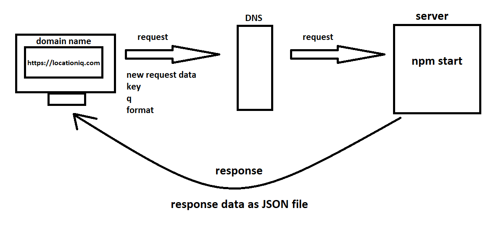

# City Explorer

**Author**: Mohammad Khaled Abu Mattar
**Version**: 1.0.0

Data Flow




## Overview
<!-- Provide a high level overview of what this application is and why you are building it, beyond the fact that it's an assignment for this class. (i.e. What's your problem domain?) -->

Web App for Locate on the map with a stunning, simple, and easy-to-use gui.

## Getting Started
<!-- What are the steps that a user must take in order to build this app on their own machine and get it running? -->

```
git clone https://github.com/MKAbuMattar/city-explorer.git

cd city-explorer

npm i

npm start
```

## Architecture
<!-- Provide a detailed description of the application design. What technologies (languages, libraries, etc) you're using, and any other relevant design information. -->

languages

```
JavaScript, reactjs
```

libraries

```bash
#react-bootstrap
npm install react-bootstrap bootstrap

#axios
npm install axios
```

## Change Log
<!-- Use this area to document the iterative changes made to your application as each feature is successfully implemented. Use time stamps. Here's an example:

01-01-2001 4:59pm - Application now has a fully-functional express server, with a GET route for the location resource. -->

this app has quick and fast connection to the api, 4ms for get data.

## Credit and Collaborations
<!-- Give credit (and a link) to other people or resources that helped you build this application. -->

this app  made With ❤ & a lot ☕ By Mohammad Khaled Abu Mattar

Name of feature: get data using `axios`, check if the request has errors, and display the error, without crashing the app, or you send empty request, to limit connection to api.

Estimate of time needed to complete: 2h

Start time: 4:12

Finish time: 7:30

Actual time needed to complete: ~3h

***

A link to the deployed version of your latest code.

https://bcity.netlify.app/

A link to your public Trello board.  

https://trello.com/b/yIyzWYc8/city-explorer

A question within the context of today’s lab assignment.

nothing.

An observation about the lab assignment, or related ‘Ah-hah!’ moment.

nothing.

How long you spent working on this assignment.

3h