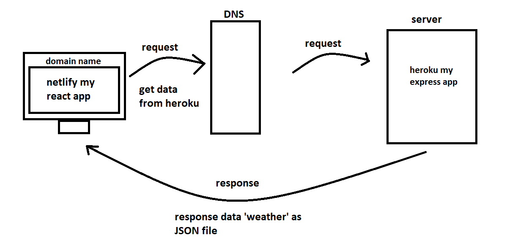
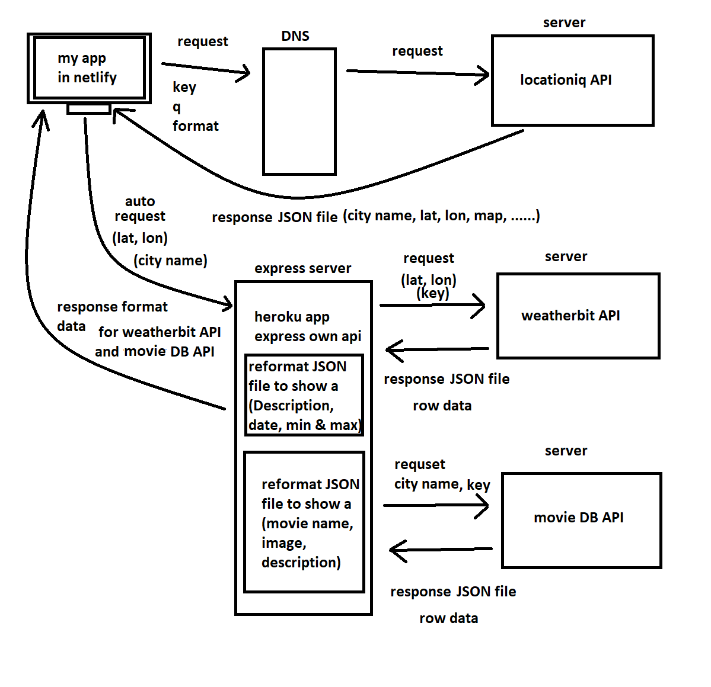

# City Explorer

**Author**: Mohammad Khaled Abu Mattar
**Version**: 1.2.0

## Lab 06

Data Flow locationiq API

My partner is Dina Khaleel.


***

## Lab 07

My partner is Ayah Zaareer.

Ayah Zaareer's repository, This was a nice project; I don't understand variable names as in the constructor at app in this.state (output1, output2), but the rest of the code is simple to understand; I read spaghetti code, and Ayah Zaareer's code follows the rules; to better, modify variable names, and break app.js into tiny components.

Data Flow My Own API



***

## Lab 08

My partner is Enas Batayneh.

Enas's project,  was a nice, she need to delete files the not used   , otherwise  the code is easy to understand, she have some issues in design, the code follows the rules, she should modify some files, and devid  the "app.js" into  components and refocus on the design.



## Overview
<!-- Provide a high level overview of what this application is and why you are building it, beyond the fact that it's an assignment for this class. (i.e. What's your problem domain?) -->

Web App for Locate on the map with a stunning, simple, and easy-to-use gui, My express server talk to two server `Weather bit API` & `Movie DB API`.

## Getting Started
<!-- What are the steps that a user must take in order to build this app on their own machine and get it running? -->

```
git clone https://github.com/MKAbuMattar/city-explorer.git

cd city-explorer

npm i

npm start
```

My Own API

```
git clone https://github.com/MKAbuMattar/city-explorer-express-server.git

cd city-explorer-express-server

npm i

npm start
```

## Architecture
<!-- Provide a detailed description of the application design. What technologies (languages, libraries, etc) you're using, and any other relevant design information. -->

languages

```
JavaScript, reactjs, express, axios, cors, dotenv
```

libraries

```bash
#react-bootstrap
npm install react-bootstrap bootstrap

#axios
npm install axios

#express
npm i express

#cors
npm i cors

#cors
npm i cors

#dotenv
npm i dotenv

#superagent
npm i superagent
```

## Change Log
<!-- Use this area to document the iterative changes made to your application as each feature is successfully implemented. Use time stamps. Here's an example:

01-01-2001 4:59pm - Application now has a fully-functional express server, with a GET route for the location resource. -->

this app has quick and fast connection to the api, 4ms for get data, and you components for broke  large component for simplify the code

## Credit and Collaborations
<!-- Give credit (and a link) to other people or resources that helped you build this application. -->

this app  made With ❤ & a lot ☕ By Mohammad Khaled Abu Mattar

Name of feature: get data using `axios`, check if the request has errors, and display the error, without crashing the app, or you send empty request, to limit connection to api, add `express` for own server, and push `express` server to `heroku` for back end talk to two server `Weather bit API` & `Movie DB API` and `express` server reformat the row data form `Weather bit API` & `Movie DB API`, response to my webapp `frontend`, New API `Yelp` now you can see a restaurants in your area, as cards has image, price, title, and button for visit the restaurant you chose it.

***

lab 06

Estimate of time needed to complete: 2h

Start time: 4:12

Finish time: 7:30

Actual time needed to complete: ~3h

***

lab 07

Estimate of time needed to complete: 4h

Start time: 11:00 am

Finish time: 2:30 am

Actual time needed to complete: ~4:30h

total 

Actual time needed to complete: ~7:30h

***

lab 08

Estimate of time needed to complete: 4h

Start time: 11:30 am

Finish time: 2:30 am

Actual time needed to complete: ~4h

total 

Actual time needed to complete: ~11:30h

***

lab 09

Estimate of time needed to complete: 1h

Start time: 11:30 am

Finish time: 1:30 am

Actual time needed to complete: ~1:30h

total 

Actual time needed to complete: ~13:00h

***

lab 10

Estimate of time needed to complete: 2h

Start time: 01:00 am

Finish time: 2:30 am

Actual time needed to complete: ~1:30h

total 

Actual time needed to complete: ~14:30h

***

A link to the deployed version of your latest code.

https://bcity.netlify.app/

https://city-explorer-express-server.herokuapp.com/

A link to your public Trello board.  

https://trello.com/b/yIyzWYc8/city-explorer

A question within the context of today’s lab assignment.

nothing.

An observation about the lab assignment, or related ‘Ah-hah!’ moment.

nothing.

How long you spent working on this assignment.

~14:30h
